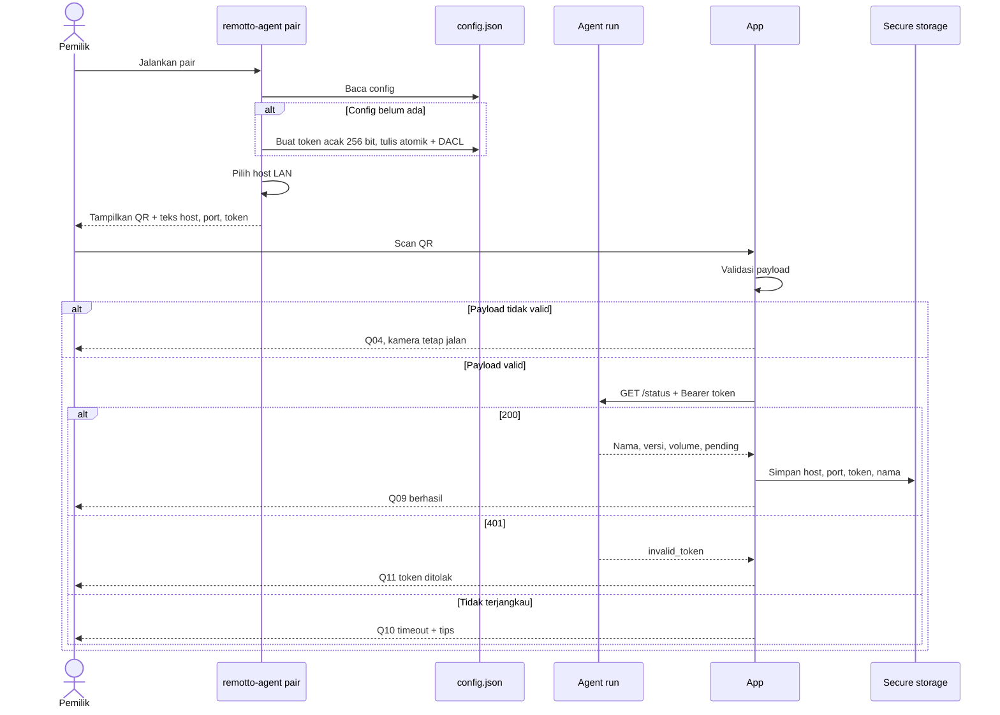
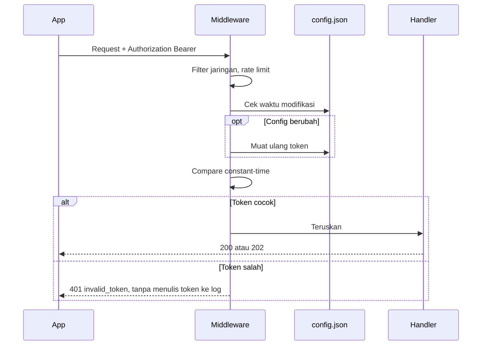
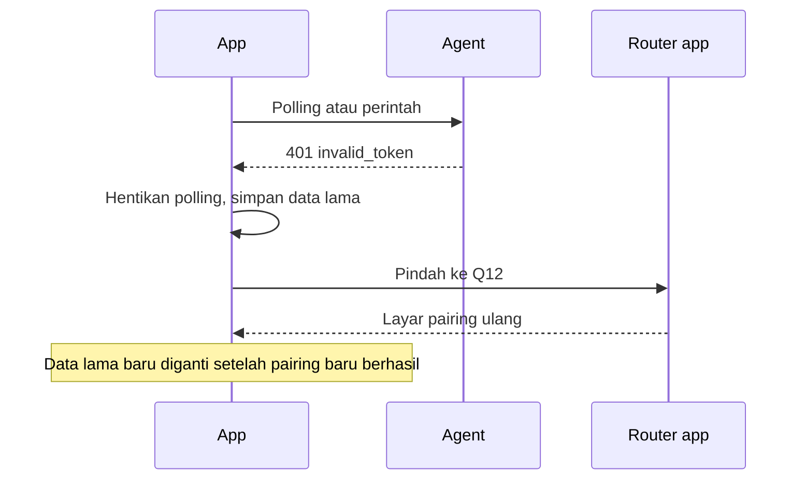
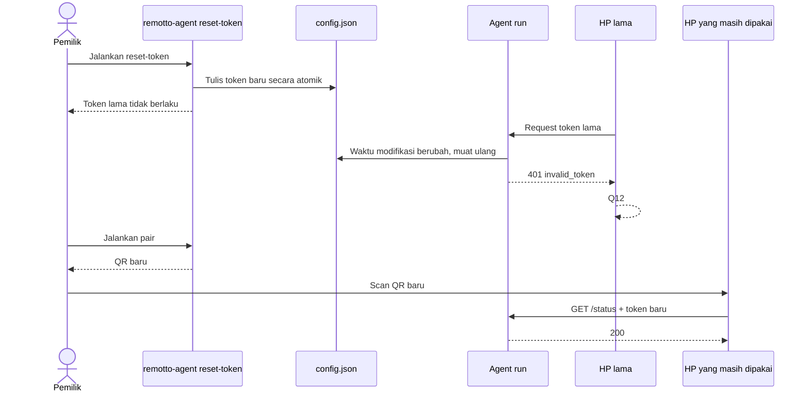

# Pairing & Auth Flow

## First run sampai tersimpan

```mermaid
sequenceDiagram
  actor U as Pemilik
  participant P as remotto-agent pair
  participant C as config.json
  participant G as Agent run
  participant A as App
  participant S as Secure storage

  U->>P: Jalankan pair
  P->>C: Baca config
  alt Config belum ada
    P->>C: Buat token acak 256 bit, tulis atomik + DACL
  end
  P->>P: Pilih host LAN
  P-->>U: Tampilkan QR + teks host, port, token
  U->>A: Scan QR
  A->>A: Validasi payload
  alt Payload tidak valid
    A-->>U: Q04, kamera tetap jalan
  else Payload valid
    A->>G: GET /status + Bearer token
    alt 200
      G-->>A: Nama, versi, volume, pending
      A->>S: Simpan host, port, token, nama
      A-->>U: Q09 berhasil
    else 401
      G-->>A: invalid_token
      A-->>U: Q11 token ditolak
    else Tidak terjangkau
      A-->>U: Q10 timeout + tips
    end
  end
```

## Request terautentikasi

```mermaid
sequenceDiagram
  participant A as App
  participant M as Middleware
  participant C as config.json
  participant H as Handler

  A->>M: Request + Authorization Bearer
  M->>M: Filter jaringan, rate limit
  M->>C: Cek waktu modifikasi
  opt Config berubah
    M->>C: Muat ulang token
  end
  M->>M: Compare constant-time
  alt Token cocok
    M->>H: Teruskan
    H-->>A: 200 atau 202
  else Token salah
    M-->>A: 401 invalid_token, tanpa menulis token ke log
  end
```

## Token ditolak saat dipakai

```mermaid
sequenceDiagram
  participant A as App
  participant G as Agent
  participant R as Router app

  A->>G: Polling atau perintah
  G-->>A: 401 invalid_token
  A->>A: Hentikan polling, simpan data lama
  A->>R: Pindah ke Q12
  R-->>A: Layar pairing ulang
  Note over A: Data lama baru diganti setelah pairing baru berhasil
```

## Reset token

```mermaid
sequenceDiagram
  actor U as Pemilik
  participant T as remotto-agent reset-token
  participant C as config.json
  participant G as Agent run
  participant A as HP lama
  participant B as HP yang masih dipakai

  U->>T: Jalankan reset-token
  T->>C: Tulis token baru secara atomik
  T-->>U: Token lama tidak berlaku
  A->>G: Request token lama
  G->>C: Waktu modifikasi berubah, muat ulang
  G-->>A: 401 invalid_token
  A-->>A: Q12
  U->>T: Jalankan pair
  T-->>U: QR baru
  U->>B: Scan QR baru
  B->>G: GET /status + token baru
  G-->>B: 200
```
